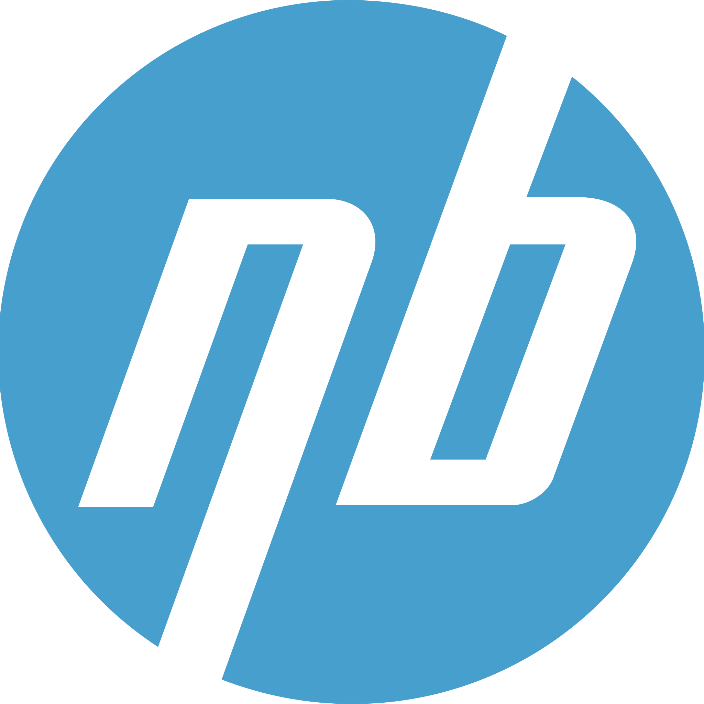
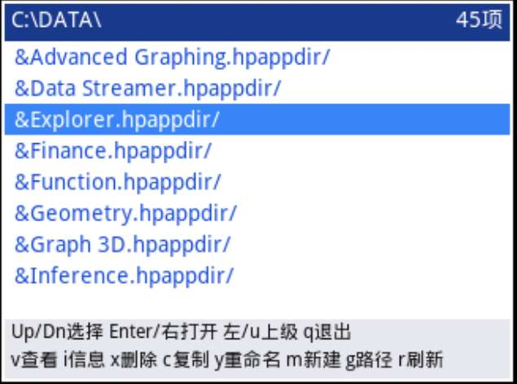

# Nbprime 
<div align="center">
<p>
  
</p>
</div>

**N**ew **B**inary for **Prime**

[简体中文](README.zh-CN.md) | English

> *This README is translated from Chinese by DeepSeek-v4-flash LLM.*

[](LICENSE)
[]()

***Make Prime great again.***

## What is this project?

**Nbprime** is an open-source project built for the Prime calculator (formerly HP Prime), with three core goals:

1. **Unleash hardware performance** – by leveraging an official OS backdoor to run native binaries, tapping into the Prime's low-level capabilities.
2. **Provide a complete toolchain** – offering an all-in-one solution for compiling, debugging, and deploying on the Prime.
3. **Build a community ecosystem** – bringing together Prime enthusiasts worldwide to share knowledge, experience, and creativity.

The project is still in its early stages, with a basic binary loader prototype already working and several sample programs available. We warmly welcome you to join us!



## I want to get started quickly!

### Requirements
- A Prime calculator (**hardware revision G1, firmware version 20250915**)
- USB data cable
- Host toolchain: `arm-none-eabi-gcc`, `make`, `python3`

### One‑click experience

You can directly download the [`examples/`](https://github.com/nbprime-team/app-collection/blob/main/examples/) folder – all programs are pre‑compiled! Just transfer them to your Prime and run.

```bash
git clone https://github.com/nbprime-team/app-collection/blob/main/examples.git
cd examples
```

For detailed steps, see [`getting-started`](https://github.com/nbprime-team/docs/blob/main/getting-started.md).

## What features are available now?

- [x] Basic binary loader (with text I/O)
- [x] Basic Prime graphics library
- [x] Event handling and response
- [x] Partial OS ABI calls
- [x] Full mathematical computation support
- [x] Simple Makefile build system
- [ ] Complete SDK documentation (planned)
- [ ] Cross‑platform toolchain for PC, mobile, and Prime

## I want to develop my own programs!

A good start is half the battle. You'll need:

- **Compiler toolchain**: GNU ARM Embedded Toolchain
- **Target platform**: Prime G1 (ARM9‑based)
- **Development environment**: Linux / WSL2

See [`developing`](https://github.com/nbprime-team/docs/blob/main/developing.md) for details.

## Where can I find the files I need?

Check these out:

- [**app-collection**](https://github.com/nbprime-team/app-collection) – a collection of small binary applications.
  - **examples/** – ready‑to‑run sample programs you can drop onto your calculator.
- [**docs**](https://github.com/nbprime-team/docs) – human‑readable documentation; also LLM‑friendly.
- [**legacy**](https://github.com/nbprime-team/legacy) – an archive of all native PPL / MicroPython programs that could potentially be ported to binaries. **No stability guarantees** for this repo.
- [**toolchain**](https://github.com/nbprime-team/toolchain) – core development toolchain; Prime‑platform standard C library.
- **prime-xxx** – large, actively maintained applications that require long‑term support.

## I want to contribute!!

We welcome all forms of contribution, including but not limited to:
- Reporting bugs (opening issues)
- Suggesting new features (opening issues)
- Submitting code (Pull Requests)
- Improving documentation
- Writing tutorials or sharing experiences

Please read [`CONTRIBUTING.md`](CONTRIBUTING.md) first.

## FAQ

**Q: … my Prime isn't the G1 revision, or the firmware isn't 20250915 – can I still use it?**  
A: Currently we only support the hardware and firmware versions mentioned above. Contributions to adapt other versions are welcome!

**Q: … will flashing affect the original system?**  
A: No, our loader runs via USB using a backdoor, and does not interfere with the original official OS functions.

> This organization uses the [MIT License](LICENSE) – you are free to use, modify, and distribute.
```